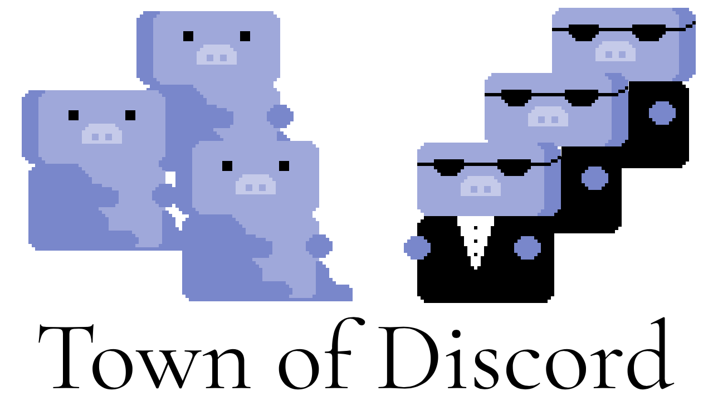

# TMBST Discord Hack Week 2019 Submission - "Town of Discord"

## Set-Up Information!!!
Invite the bot: https://discordapp.com/oauth2/authorize?client_id=592849793215234049&scope=bot&permissions=0

Attention server owners, you'll need to add two roles to the server for our bot to correctly play the game.
"dead" - This role is given to townspeople that die. (Should be able to read text-channels, but not send messages)
"alive" - This role is given to the townspeople that are alive. (Should be able to read text-channels and send messages)  

Emergency stop game: !teardown.

## Description
This is our own spin off on the already known popular game: "Town of Salem".  
We limited the scope to just the mafia and citizens in order to have a nice working core.  
In the future, we hope to add more roles such as Doctor and Serial Killer to make the game more interesting.

## Further explaination of "Town of Discord" and Game Mechanics.
The goal of the ordinary citizen is to kill off the mafia by all means possible. You can start pointing figures you can get suspicious of people not talking, there is plenty of ways to find out who is who. The goal of the mafia is of course to kill off all the ordinary citizens. Each night, everyone (but the Mafia) goes to sleep. The mafia during the night is able to choose a user they wish to kill. When day arises, that user is now dead and it is up to the citizens to quickly figure out who the mafia is before more of the innocent dies.  

There are extra roles such as Doctor who can protect a citizen from an attack overnight. Serial Killer, who is its own entity and is not friendly towards citizens and mafia. The Serial Killer's goal is to kill everyone. These roles will be added in future implementations once we have confirmed a working core game.

## Commands 
!join - Bot sends an embedded message where users can react with a :thumbs-up: to join the game.  
!teardown - When the game has ended or something goes wrong, the teardown command allows you to delete the game. Type "!join" to restart the game.  
!suspect <user> - During the day, if the majority of votes accuses a user for being a part of the mafia then they get the banhammer.  
!kill <user> - At night, the players that are a part of the mafia can kill one citizen.  

## Authors
 * [Michael Farrier](https://github.com/michaelFarrier) -- Discord: DuckyTape#3235
 * [Justin Greene](https://github.com/greenerino) -- Discord: Vikola#6329
 * [Naitra Iriumi](https://github.com/naitrai) -- Discord: Naitra#3812
